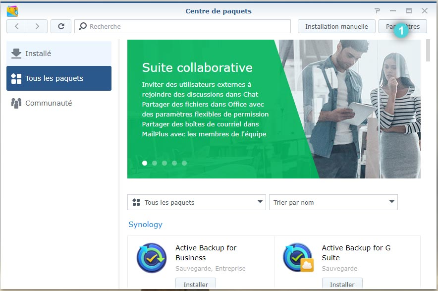
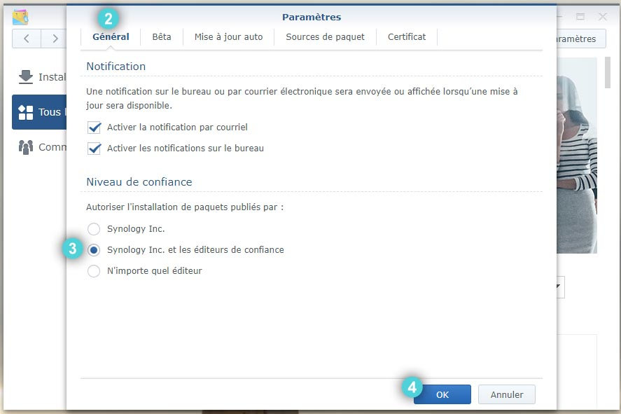

# Auto-Update your Plex Media Server on your Synology NAS [French Edition]

## Description
Maintenez automatiquement votre serveur Plex à jour sur votre NAS Synology.

## Remerciements
Ce script est basé sur les travaux de [martinorob](https://github.com/martinorob/plexupdate) que j'ai traduit en français et où j'ai ajouté des améliorations mineures pour administrer l'accès au volume d'installation de Plex automatiquement. Merci à lui de partager son travail sur [le forum de Plex](https://forums.plex.tv/t/script-to-auto-update-plex-on-synology-nas-rev6/479748).

## Pré-requis
1. Ajouter la clé publique de signature de paquets de Plex au Synology NAS Package Center. Pour cela, je vous invite à suivre [le tutoriel sur le site de Plex.](https://support.plex.tv/articles/205165858-how-to-add-plex-s-package-signing-public-key-to-synology-nas-package-center/) Sans cela, vous obtiendrez une erreur [289] lors de la mise à jour automatique.

1. Modifier le paramètre de ```Niveau de confiance``` de l'onglet ```Général``` des ```Paramètres``` du ```Centre de paquets``` sur la valeur ```Synology Inc. et les éditeurs de confiance```.


 | 
------------ | -------------

3. Prendre note des groupes utilisateurs que vous souhaitez qui accèdent ou non au volume d'installation de Plex (pour ma part, j'autorise seulement les groupes administrators et video à accéder à ce volume). Ce volume est strictement utilisé pour le fonctionnement du serveur Plex et non pour l'accès à vos fichiers via votre client Plex. C'est pourquoi il est strictement recommandé que seul les utilisateurs avertis puissent y accéder.

3. Préparer un emplacement sur le NAS où stocker le fichier du script.

## Utilisation
1. Télécharger le script sur votre ordinateur.

1. Ouvir le script avec votre éditeur de fichier préféré puis, modifier ```*YOUR_UNAUTHORIZED_USERS_GROUP*``` par les groupes d'utilisateurs dont **vous ne souhaitez pas autoriser** l'accéder au volume d'installation du NAS.

1. Modifier ```*YOUR_AUTHORIZED_USERS_GROUP*``` par les groupes d'utilisateurs dont **vous souhaitez autoriser** l'accéder au volume d'installation du NAS.

*Notez que les groupes commencent par un @, tandis que les utilisateurs non. Chaque groupe et utilisateur doivent être séparés d'une virgule et d'un espace. Ex. :  ```@groupe1, @groupe2, utilisateur1, utilisateur2```*

4. Déposer votre script à l'emplacement que vous aurez précédement déini sur votre NAS.

4. Ouvrir ```Planificateur de tâches``` via le ```Panneau de configuration``` *(uniquement visible en mode avancé)*.

4. Cliquer sur ```Créer``` > ```Tâche planifiée``` > ```Script défini par l'utilisateur```

4. Dans l'onglet ```Général```, nommer votre tâche et définissez l'utilisateur sur ```root```.

4. Dans l'onglet ```Programmer```, choissisez la fréquence d'éxécution de votre tâche.

4. Dans l'onglet ```Paramètres de tâche```, coller le code suivant ```bash /*SCRIPT_EMPLACEMENT*/plex_update.sh```.

4. Remplacer ```*SCRIPT_EMPLACEMENT*``` par l'emplacement de votre script sur votre NAS et cliquer sur OK.

4. Si vous souhaitez recevoir des courriels à chaque execution du script, cochez la case ```Envoyer les détails d'exécution par e-mail```.

4. Enjoy !
